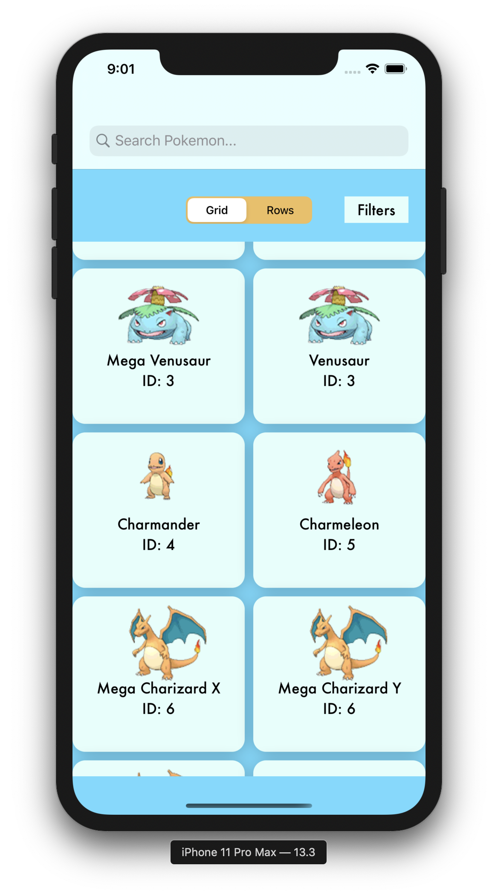
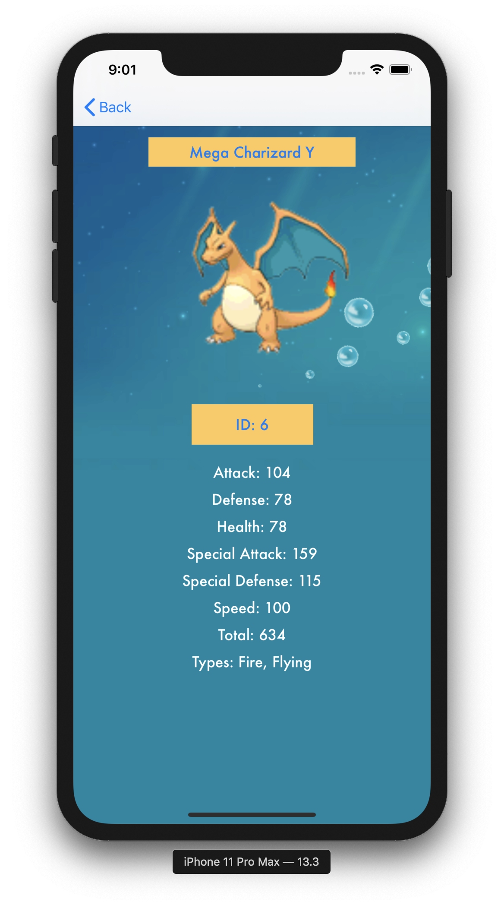
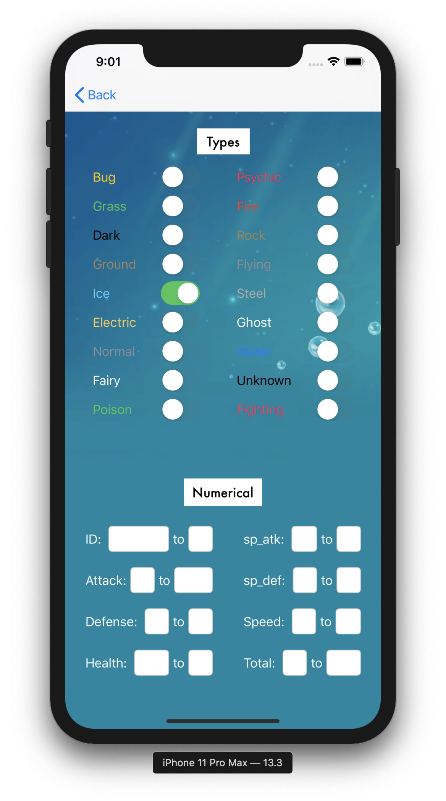

# Pokedex

## Description

Hi! This is my second project that I've made for Mobile Developers of Berkeley. This project is a Pokedex, where users can search from all of the Pokemon! It consists of 3 screens, you can see the total number of Pokemon, click on each to view their description, and also filter from the Pokemon list. I had lots of fun making this project, but in the future I would definitely try to condense some of the code I wrote for the advanced filtering. Furthermore, I managed to follow the model of MVC this time, so I definitely would like to see improvement in the future!

## Screen 1

This is the starter screen, which is the Pokedex.

## Screen 2

This is the description screen! Click away to find the description of each Pokemon.

## Screen 3

This is the advanced filters screen! Click away to select the options at which you want to filter your Pokemon.

